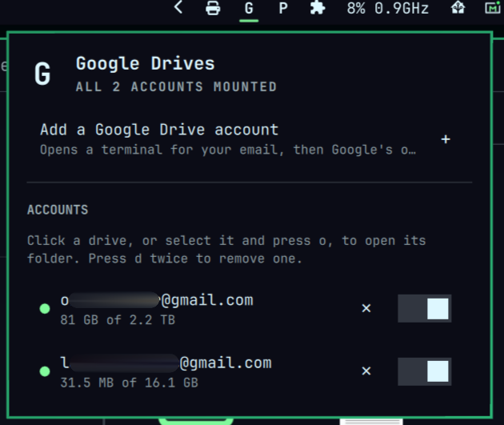

# Google Drives



Google Drive, mounted like a real folder, for as many accounts as you have.
A bar widget for [Omarchy](https://omarchy.org/) that turns Google Drive into
`~/GoogleDrive/<account>`, right there in your file manager, no browser tab
required — with local disk usage bounded to a fixed cap no matter how large
the Drive account actually is.

## Install

```bash
omarchy plugin add https://github.com/spuder/omarchy-google-drives.git --enable
~/.config/omarchy/plugins/spencerowen.googledrive/install.sh
```

The first line clones and enables the widget; the second installs rclone,
fuse3, and the helper scripts it needs. No manual `git clone` required.

Click "Add a Google Drive account" in the panel. That opens a terminal
asking for the account's email, then hands off to rclone's own browser
sign-in — approve access for that Google account and you're done. This
plugin never sees your Google password: there's no in-panel credential
form at all, because Drive's OAuth hand-off means there's nothing for one
to collect. Once sign-in verifies, the account mounts itself automatically
and a desktop notification confirms it — nothing to come back and copy
from the terminal by hand, which matters since Google's consent screen
takes over the whole browser window and getting back to a small floating
terminal afterward is real friction. Add as many accounts as you like;
each shows up as its own row, and each is a separate trip through Google's
account chooser, so you can sign in with a different account every time.

Remove with `~/.config/omarchy/plugins/spencerowen.googledrive/uninstall.sh`
(your signed-in accounts and mounted files are left alone; see the script
for exactly what it does and doesn't touch).

### Google OAuth client ID

rclone's shared Google Drive OAuth client is being retired during 2026.
Each user should create a personal **Desktop app** OAuth client by
following [rclone's client ID guide](https://rclone.org/drive/#making-your-own-client-id)
and pass it to `rclone config create` (or `rclone config reconnect <id>:`
to update an existing account). This plugin doesn't ship or reuse a shared
client ID, and never reads the client ID, secret, or token directly —
rclone owns that configuration.

## Why this one

Google has never shipped an official Google Drive **sync** client for
Linux — [Google Drive for desktop](https://support.google.com/a/answer/7491144)
is Windows/macOS only, and there is no official Drive CLI with a sync or
mount command. So, like the other rclone-based Omarchy plugins,
[rclone](https://rclone.org/drive/)'s Google Drive backend does the actual
transfer and OAuth here — nothing custom.

- **Bounded disk usage, regardless of Drive size.** This is a real `rclone
  mount` (FUSE) with a capped local cache (`--vfs-cache-max-size`, default
  20 GB), not a full local copy. A 2 TB Drive account works fine on a
  200 GB disk: content fetches on demand, recently-used files stay cached
  for offline access, and least-used cached files are evicted once the cap
  is hit. See [PLAN.md](PLAN.md) for why this plugin deliberately does
  *not* use `rclone bisync` for this — bisync has no way to bound local
  disk usage, so it can't safely handle a Drive account bigger than free
  local disk.
- **Multiple accounts, at once.** Personal, work, whatever else: each
  gets its own row in the panel, its own folder, its own pause/resume
  toggle, all signed in and mounted simultaneously — with a separate,
  isolated rclone config per account so one expired token can't touch
  another.
- **Works with whatever file manager you actually run.** Omarchy isn't
  tied to one desktop environment, so there's no single "the" file manager
  the way macOS has Finder. The mount itself needs no integration at all —
  it's a real directory, browsable in Nautilus, Dolphin, Thunar, Nemo, or
  anything else exactly like any other folder. The panel's "open folder"
  action uses `xdg-open`, which resolves to whatever your session has
  actually registered as its default folder handler, rather than assuming
  one.

## How the mount works, and its limits

Each account gets its own `rclone mount` (see `bin/googledrive-mount`),
run by its own `omarchy-google-drive-mount@<id>.service` systemd user unit,
with:

- `--vfs-cache-mode=full` — content fetches on open; local writes and
  recently-opened files are cached.
- `--vfs-cache-max-size=20G` (default, override per account via
  `GOOGLEDRIVE_CACHE_MAX_SIZE` in its env file) — a hard cap on total cache
  size. This is the actual fix for "more data in Drive than free disk":
  least-recently-used cached files are evicted once the cap is hit.
- `--vfs-cache-min-free-space=5G` — an extra safety margin independent of
  the cap above.

The real trade-off, stated plainly: **there is no way to guarantee a
specific file or folder stays available offline.** Cache eviction is
least-recently-used only — close your laptop for a week and something
you'll need on a flight can get silently evicted before you reopen it.
Every "cold" file open is a live network round trip. If you need a
specific folder to always be available offline regardless of how recently
you touched it, this plugin doesn't provide that (an earlier design pass
considered layering `rclone bisync` on top for exactly that; see
[PLAN.md](PLAN.md) for why that turned out to conflict with the disk-space
goal badly enough to drop for v0.1).

## Configure

Settings are stored inline with the widget entry in
`~/.config/omarchy/shell.json` and can be changed with `omarchy bar set`:

```sh
omarchy bar set spencerowen.googledrive refreshIntervalSec 60 --json
omarchy bar set spencerowen.googledrive mountRoot "$HOME/GoogleDrive"
omarchy bar set spencerowen.googledrive showQuota false --json
```

The cache size cap is per-account, set in its env file rather than as a
shell setting (see `~/.config/omarchy-google-drive/<id>/env`):

```sh
echo 'GOOGLEDRIVE_CACHE_MAX_SIZE=40G' >> ~/.config/omarchy-google-drive/<id>/env
systemctl --user restart omarchy-google-drive-mount@<id>.service
```

## CLI

Everything the panel does is also a plain command:

```sh
googledrive-accountctl list
googledrive-accountctl add alice@gmail.com     # opens rclone's browser sign-in, then mounts
googledrive-accountctl pause alice              # unmount
googledrive-accountctl resume alice             # mount again
googledrive-accountctl remove alice             # forget the account (keeps local files)

systemctl --user status omarchy-google-drive-mount@alice.service
journalctl --user -u omarchy-google-drive-mount@alice.service -f
```

The id (`alice` above) is derived from the part of the email before `@`,
sanitized and de-duplicated automatically — `googledrive-accountctl list`
shows you the id it actually picked. Override it with `--id` on `add` if
you want something else.

## Comparison

There's a real sister project to this one for Proton Drive:
[spuder/omarchy-protondrive](https://github.com/spuder/omarchy-protondrive).
Same author, same architecture (per-account isolated rclone config,
per-account systemd unit, one bar-widget panel), same reasoning for using
rclone instead of a hand-rolled sync engine — this plugin follows that
mount-per-account shape directly.

Three existing Omarchy plugins also cover Google Drive:

- **[edbron/omarchy-cloud-drives](https://github.com/edbron/omarchy-cloud-drives)**
  — `rclone mount` for Google Drive, OneDrive, and iCloud Drive, each at
  one **fixed path** per provider (`~/Cloud/GoogleDrive`). One Google
  account at a time; a second one has to replace the first.
- **[JoshuaFurman/omarchy-cloud-plugin](https://github.com/JoshuaFurman/omarchy-cloud-plugin)**
  — a more general `rclone mount` wizard covering many backends, with a
  configurable VFS cache size, same core mechanism this plugin uses.
- **[wesleycole/omarchy-google-drive](https://github.com/wesleycole/omarchy-google-drive)**
  — Google Drive specifically, also `rclone mount`, also one remote
  (`gdrive` by default). Thin and well-documented, but doesn't manage
  rclone config itself (you run `rclone config` yourself first) and opens
  files specifically in Nautilus rather than the session's default handler.

All three are architecturally close to this plugin now — mount plus VFS
cache is the right tool for "browse Drive without running out of disk," and
there's no point reinventing it differently. What none of the three do is
run **multiple Google accounts simultaneously with full isolation**:
edbron mounts one fixed path per provider, wesleycole supports a single
named remote, and JoshuaFurman's wizard, while flexible across backends, is
not built around several accounts of the *same* backend coexisting. That's
the actual gap this plugin closes — matching what `omarchy-protondrive`
already does for account isolation, applied to Google Drive.

(An earlier design of this plugin used `rclone bisync` for genuine
two-way, offline-capable sync instead of a mount. See
[PLAN.md](PLAN.md#why-mount-not-bisync-decision-history) for why that was
reverted: bisync requires a full local replica of anything in its scope,
with no disk-space awareness at all, so a Drive account bigger than free
local disk would either fail outright or silently fill the disk.)

## Security and privileges

Omarchy plugins run **unsandboxed** with your user permissions — review
`Service.qml` and the `bin/` scripts before enabling any plugin, this one
included.

- OAuth tokens live in rclone's own per-account config file
  (`~/.config/omarchy-google-drive/<id>/rclone.conf`, directory `0700`)
  and are never read directly by this plugin — only ever passed by
  reference (`--config <path>`) to `rclone` itself.
- `googledrive-accountctl` writes `accounts.json` atomically (temp file +
  `os.replace`) and refuses a symlinked target or state directory.
- Commands are run as argument arrays, never interpolated shell strings.
- Revoke access any time from your
  [Google Account security page](https://myaccount.google.com/permissions).

## Requirements

- Omarchy with the Quickshell/Quattro shell plugin runtime
- `rclone` and `fuse3`, installed automatically by `install.sh`
- A file manager of your choice, and a browser for Google's OAuth sign-in

## Developing

Pulled a code change into an already-installed copy with `omarchy plugin
update`? Also run `omarchy restart shell` — an active bar widget doesn't
reload its QML from a plugin rescan alone, and `Model.js` (a `.pragma
library`) doesn't reload at all short of that restart.

```sh
node --test test/                 # Model.js unit tests
./test/status-fixture.sh           # googledrive-status --demo smoke test
omarchy plugin validate .          # manifest against the Omarchy schema
```

The fuller design writeup — including why bisync was tried and reverted —
lives in [PLAN.md](PLAN.md).

## License

MIT, see [LICENSE](LICENSE).
